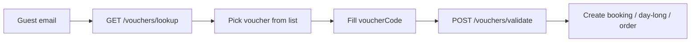

# Fix types + admin voucher search/apply by email

## Defaults

- Shared UI component used in all three apply dialogs (not three more copy-pastes).
- New staff endpoint `GET /api/vouchers/lookup?email=` for **APPLY** roles (Receptionist included), returning vouchers for that identity **plus** `code` when `codePlain` exists so staff can one-click apply.
- Restaurant gains an optional guest email field so personal vouchers can match.

---

## 1. Fix TypeScript errors

From current `tsc --noEmit`:

| App | Fix |
|-----|-----|
| Admin | Remove unused `Plus` import in [`Bookings.tsx`](apps/admin/src/pages/Bookings/Bookings.tsx) |
| Server | Remove/use unused `shareType` in [`shareholderController.ts`](apps/server/src/controllers/shareholderController.ts) |
| Server | Type filter callbacks in [`voucherController.ts`](apps/server/src/controllers/voucherController.ts) email-lookup branch (`(v: { name?: string; ... })` or cast list after `findVouchersForIdentities`) |

Re-run admin + server `tsc --noEmit` until clean of these.

---

## 2. Staff lookup API (APPLY roles)

In [`voucherRoutes.ts`](apps/server/src/routes/voucherRoutes.ts) add **before** `/:id`:

`GET /vouchers/lookup?email=` → `roleCheck(APPLY)`

Handler (reuse `resolveAssigneeIdentities` + `findVouchersForIdentities` from [`utils/voucher.ts`](apps/server/src/utils/voucher.ts)):

- Require valid email query.
- Return active vouchers for matched Guest/User/Shareholder identities.
- Include public vouchers (no assignees) for that channel context is **not** filtered server-side by channel; client filters by `appliesRoom` / `appliesDayLong` / `appliesRestaurant`.
- Response shape for each row: safe fields + **`code` from `codePlain` when present** (admin apply only). Never return `codeHash`.
- Do **not** change public `POST /public/vouchers/for-email` (stays hint-only).

---

## 3. Shared admin component

Add [`apps/admin/src/components/VoucherApplyField.tsx`](apps/admin/src/components/VoucherApplyField.tsx):

Props: `channel`, `grossAmount`, `lineItems`, `guestEmail`, `guestId?`, `value` / `onChange` for code, optional `preview` callbacks.

UI:

1. Shows current guest email (read-only hint) or empty-state “Enter guest email to search vouchers”.
2. Debounced `GET /vouchers/lookup?email=` when email looks valid → compact list (name, discount, channels, code if available).
3. Click row → set code + auto-call validate (same as today’s Apply).
4. Keep manual code `Input` + Apply for codes not in list / no `codePlain`.
5. Surface server `message` on validate errors.

---

## 4. Wire into three create flows

| Flow | File | Changes |
|------|------|---------|
| Room booking | [`ManualBookingDialog.tsx`](apps/admin/src/pages/Bookings/ManualBookingDialog.tsx) | Replace inline voucher block with `VoucherApplyField`; email from existing guest / form email |
| Day Long | [`DayLong.tsx`](apps/admin/src/pages/DayLong/DayLong.tsx) | Same; email from form / `pickedGuest` |
| Restaurant | [`Restaurant.tsx`](apps/admin/src/pages/Restaurant/Restaurant.tsx) | Add optional **Guest email** input on create-order dialog; use `VoucherApplyField` with `channel: 'RESTAURANT'` |

---

## 5. Restaurant server assignee fix

In [`restaurantController.ts`](apps/server/src/controllers/restaurantController.ts):

- Accept optional `guestEmail` on create (and update if voucher applied).
- Pass `assignee: { userId, guestEmail }` into `validateVoucherForCheckout` so SHAREHOLDER/GUEST/USER locks resolve by email (same as booking/day-long).

No schema change required for orders unless an email column already exists; email is only needed for voucher assignee context at apply time.

---

## Out of scope

- Editing existing restaurant orders to add vouchers.
- Public web booking changes (already has for-email list).
- Regenerating plaintext for old vouchers without `codePlain` (list shows hint; staff type code manually).
