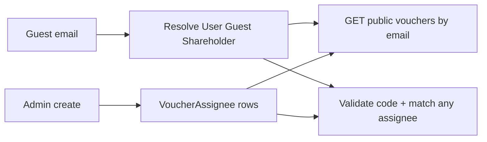

# Fix booking SSR + multi-assignee vouchers by email

## Defaults chosen

- **Booking empty rooms:** SSR uses `INTERNAL_API_URL` inside Docker; browser keeps `NEXT_PUBLIC_API_URL`.
- **Assignees:** new `VoucherAssignee` join table (0 = public/`NONE`, 1+ = locked to any of those people). Migrate existing `assigneeType`/`assigneeId` into rows, then stop writing the old columns (keep nullable for one release or drop after backfill).
- **Identity:** same email can resolve Guest + User + Shareholder; checkout matches if **any** assignee row matches **any** resolved identity.
- **Surfaces:** admin multi-assign on create/edit **and** public `/booking` list of vouchers for the entered email (safe fields + `codeHint` only; still apply with code).



---

## 1. Booking: no rooms available (Docker SSR)

**Cause:** [`apps/web/src/lib/resort-api.ts`](apps/web/src/lib/resort-api.ts) `apiBase()` uses `NEXT_PUBLIC_API_URL=http://localhost:8000/...`, which is ECONNREFUSED inside the `web` container. `safeFetch` returns `null` → empty rooms.

**Fix:**
- Update `apiBase()` to use `INTERNAL_API_URL` when `typeof window === 'undefined'`, else `NEXT_PUBLIC_API_URL`.
- Set in [`docker-compose.dev.yml`](docker-compose.dev.yml) under `web`:
  - `INTERNAL_API_URL: http://api:8000/api/public`
  - keep `NEXT_PUBLIC_API_URL: http://localhost:8000/api/public`
- Mirror in [`apps/web/.env.example`](apps/web/.env.example) / root docs note.
- In [`apps/web/src/app/booking/page.tsx`](apps/web/src/app/booking/page.tsx): if rooms empty after fetch, show a clearer message that inventory could not be loaded (not only “no rooms available”) when appropriate — keep simple: distinguish via a boolean from `getRooms` returning `{ rooms, ok }` or treat `null` fetch as error.

Restart `web` after compose env change.

---

## 2. Schema: multi-assignee

In [`apps/server/prisma/schema.prisma`](apps/server/prisma/schema.prisma):

```prisma
model VoucherAssignee {
  id           String              @id @default(uuid())
  voucherId    String
  voucher      Voucher             @relation(fields: [voucherId], references: [id], onDelete: Cascade)
  assigneeType VoucherAssigneeType // GUEST | USER | SHAREHOLDER only
  assigneeId   String
  @@unique([voucherId, assigneeType, assigneeId])
  @@index([assigneeType, assigneeId])
}
```

- Add `assignees VoucherAssignee[]` on `Voucher`.
- Keep legacy `assigneeType`/`assigneeId` temporarily; backfill in seed or a one-shot in controller/`db push` after: for each voucher with type ≠ NONE and id set, create assignee row.
- `pnpm exec prisma generate` + `db push` from `apps/server`.

---

## 3. Server: validate + lookup by email across identities

### Shared resolver

New helper in [`apps/server/src/utils/voucher.ts`](apps/server/src/utils/voucher.ts) (or small `voucherIdentity.ts`):

- Input: optional `guestId`, `guestEmail`, `userId`, `shareholderId`
- If email present: load `User` by email, all `Guest`s by insensitive email, `Shareholder` by email and/or by `userId`
- Return set of `{ type, id }` identities

### `validateVoucherForCheckout`

- Load voucher with `assignees` (and fall back to legacy columns if no rows).
- If no assignees → public (anyone with code).
- Else match if **any** assignee equals **any** resolved identity.
- Email fallback for USER (`User.email`) and SHAREHOLDER (`Shareholder.email` / linked User) — same idea as existing GUEST email check.
- Improve errors:
  - Keep hash miss / inactive → `Invalid or inactive voucher code`
  - Assignee miss → clearer `This voucher is not assigned to this guest/email` (403)
  - Ensure `AppError` `message` reaches public client (BookingForm already shows preview text — surface `error.response` / JSON `message` from [`validatePublicVoucher`](apps/web/src/lib/resort-api.ts)).

### Create/update

- [`voucherValidator.ts`](apps/server/src/validators/voucherValidator.ts): replace single assignee with `assignees: { assigneeType, assigneeId }[]` (max e.g. 50). Empty array = public.
- [`voucherController.ts`](apps/server/src/controllers/voucherController.ts): transaction create voucher + `createMany` assignees; update replaces assignee set.
- [`findMineVouchers`](apps/server/src/controllers/voucherController.ts) / shareholder portal: query via `assignees` OR (USER id / SHAREHOLDER id).

### Public list by email

- `GET /api/public/vouchers?email=` (or `POST` with email after OTP — prefer **require email + OTP verified** if OTP map already exists, else email-only for active assigned vouchers with safe fields only).
- **Chosen default:** `POST /api/public/vouchers/for-email` with `{ email }` returning safe list (same fields as `/mine`). Rate-limit lightly by existing patterns if any; no plaintext codes.
- Wire checkout paths (public booking, day-long) to pass email so USER/SHAREHOLDER locks redeem when email matches.

---

## 4. Admin UI: multi-assign + search

[`apps/admin/src/pages/Vouchers/Vouchers.tsx`](apps/admin/src/pages/Vouchers/Vouchers.tsx):

- Replace single assignee select with multi-assignee list:
  - Add row: pick type (Guest / Staff / Shareholder) → search by name/email → add chip
  - Allow mix of types on one voucher
  - Remove = clear that chip
- List column: show assignee count / types (e.g. “3 recipients”) instead of single lock.
- Payload: `assignees: [{ assigneeType, assigneeId }, ...]`

Reuse existing GuestPicker / users / shareholders fetches; add simple filter-by-email on the client selects.

---

## 5. Public booking UX

[`BookingForm.tsx`](apps/web/src/components/BookingForm.tsx) + [`resort-api.ts`](apps/web/src/lib/resort-api.ts):

- After guest email is entered (blur or after OTP verify), call for-email endpoint; show compact “Vouchers for you” with name, discount, channels, `••••hint` (from [`MyVouchersPanel`](apps/admin/src/components/MyVouchersPanel.tsx) pattern — thin public version).
- Apply still requires typing/pasting code (hint helps); on validate failure show server `message` verbatim (not a generic “invalid”).
- Pass `guestEmail` on validate (already mostly there); ensure server email resolution covers staff/shareholder identities.

---

## 6. Seed + Docker voucher errors

- Update [`seed.ts`](apps/server/prisma/seed.ts) sample vouchers to use `VoucherAssignee` rows.
- If Docker DB was pushed without seed vouchers, “Invalid or inactive” is expected for `SUMMER10` etc. — re-seed or create via admin; document in seed log.
- Confirm validate returns distinct messages so logs/UI don’t look identical for wrong code vs wrong person.

---

## Out of scope

- Guest self-serve apply without code (wallet auto-apply).
- Changing plaintext code reveal after create.
- Coolify prod INTERNAL_URL unless already using compose service DNS (note in `.env.example` only).
