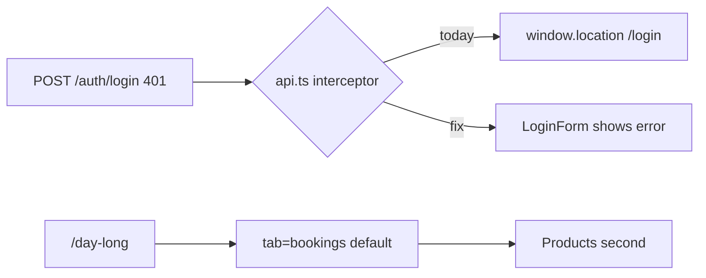

# Day Long, login fix, notes, Operations order

## 1. Day Long — bookings first, products second

**File:** [apps/admin/src/pages/DayLong/DayLong.tsx](apps/admin/src/pages/DayLong/DayLong.tsx)

- Default tab: `bookings` (not `products`).
- Swap tab button order: **Bookings** then **Products** (label can stay “Products” for catalog).
- Sync URL like Restaurant: `?tab=bookings|products` via `useSearchParams`; default/missing → `bookings`.
- Keep **New Booking** as the primary CTA on the Bookings tab; also show a compact **New Booking** in the page header so it is one click even if someone switches to Products.
- Sidebar entry for Day Long: set `tab: 'bookings'` on the Day Long item in [rbac.ts](apps/admin/src/config/rbac.ts) so `navItemHref` opens `/day-long?tab=bookings`.

## 2. Inventory movements — show notes

**File:** [apps/admin/src/pages/Inventory/Inventory.tsx](apps/admin/src/pages/Inventory/Inventory.tsx)

API already returns `notes`. Gaps are UI-only:

- Add `notes?: string | null` to the `Movement` type.
- Add a **Notes** column after **By** (or before); show `—` when empty; truncate long notes with `title` tooltip for full text.

No server change required (confirm `listMovements` still returns full rows).

## 3. Login — stop reload / wrong redirect on bad credentials

**Root cause:** [apps/admin/src/lib/api.ts](apps/admin/src/lib/api.ts) interceptor treats **every 401** as session expiry and does `window.location.href = '/login'`. Failed `POST /auth/login` returns 401, so the form never shows the error and shareholder login is forced onto staff `/login`.

**Fix:**

```ts
// In axios response interceptor: skip hard redirect for auth login failures
if (error.response?.status === 401) {
  const url = error.config?.url ?? '';
  const isLoginAttempt = url.includes('/auth/login');
  if (!isLoginAttempt) {
    localStorage.removeItem('token');
    localStorage.removeItem('user');
    window.location.href = '/login';
  }
}
```

- Keep existing Login form catch (clear password, show API message) — it will work once the interceptor stops navigating.
- Optional polish: on true session expiry, if `pathname` is `/shareholder-login` or user was shareholder, send to `/shareholder-login` instead of `/login` — only when clearing an existing session (not for login attempts). Use `localStorage` user role or current path before clear.

## 4. Operations sidebar — frequent first

**File:** [apps/admin/src/config/rbac.ts](apps/admin/src/config/rbac.ts) `getSidebarItems`

Reorder Operations items only (Finance/People/Content/System unchanged).

| Role | New Operations order |
|------|----------------------|
| SUPER_ADMIN / MANAGER | Bookings → Day Long → Inventory → Rooms → Restaurant → Guests |
| RECEPTIONIST | New Booking → All Bookings → Day Long → Room Availability → Guests (Payments stays Finance) |
| HOUSEKEEPING | Room Status → Inventory (unchanged) |
| RESTAURANT_STAFF | Orders → Menu → Inventory (unchanged) |

`SIDEBAR_SECTION` keys stay the same; only array order in `getSidebarItems` changes.



## Implementation order

1. `api.ts` login 401 skip (+ shareholder session redirect polish)  
2. Day Long default/URL/header New Booking + rbac `tab: 'bookings'`  
3. Inventory movements Notes column  
4. `rbac.ts` Operations reorder for admin/manager/receptionist
