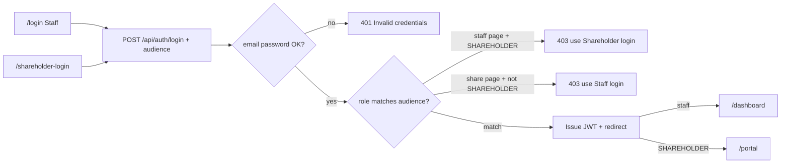

# Role logins + Finance/Inventory UX

## Scope (chosen defaults)

- **Two login pages**, not one page per staff role: Staff at `/login`, Shareholder at `/shareholder-login`. Wrong audience is **rejected during login** (before any JWT/session) — not a login-then-logout dance.
- **Finance/ops polish** focuses on Expenditures, Inventory, and Accounts (not shareholder polish from [docs/plan/12-SHAREHOLDER-POLISH-AND-NEXT.md](docs/plan/12-SHAREHOLDER-POLISH-AND-NEXT.md)).
- **RBAC hardening** for those domains first: hide/disable UI actions the role cannot do, and close UI↔API mismatches.

---

## 1. Separate login pages + form states

**Files:** [apps/admin/src/pages/Login/Login.tsx](apps/admin/src/pages/Login/Login.tsx), [apps/admin/src/App.tsx](apps/admin/src/App.tsx), [apps/admin/src/contexts/AuthContext.tsx](apps/admin/src/contexts/AuthContext.tsx), [apps/server/src/controllers/authController.ts](apps/server/src/controllers/authController.ts), [apps/server/src/validators/authValidator.ts](apps/server/src/validators/authValidator.ts)

- Extract shared form UI into something like `LoginForm` with props `audience: 'staff' | 'shareholder'`.
- Routes: `/login` → staff only; `/shareholder-login` → shareholder only. Cross-links between them (no tab toggle).
- **Audience check before session (required):**
  1. Client always sends `audience: 'staff' | 'shareholder'` with email/password (from which login screen is open).
  2. Extend `loginSchema` with required `audience`.
  3. In `authController.login`: after password validates, **before** `jwt.sign` — if `audience === 'staff'` and `user.role === 'SHAREHOLDER'` → `403` with message like “Shareholder account — use Shareholder login”; if `audience === 'shareholder'` and role is not `SHAREHOLDER` → `403` “Staff account — use Staff login”.
  4. No token written to `localStorage` on mismatch (server never returns one). Client only shows the API error; no logout/clear-token path needed for this case.
- Form-state improvements:
  - Field-level validation (empty email/password) before submit
  - Disable submit while loading; keep spinner
  - Preserve email on failed login; clear password
  - Distinct idle / loading / error / success (register) states
  - Wire forgot-password to existing server reset flow if already usable; otherwise keep mailto but make it clearly available
- Fix [Unauthorized.tsx](apps/admin/src/pages/Unauthorized.tsx) “Back” link to use `landingPath(role)` so shareholders are not bounced to `/dashboard`.

---

## 2. Role actions: disable in UI + enforce on backend

**Source of truth:** [apps/admin/src/config/rbac.ts](apps/admin/src/config/rbac.ts) + per-route `roleCheck` under `apps/server/src/routes/`.

Concrete fixes for this pass:

| Gap | Fix |
|-----|-----|
| Inventory Adjust shown to ACCOUNTANT but API is SUPER_ADMIN/MANAGER only | Split `canManage` vs `canAdjust` in UI; hide Adjust for ACCOUNTANT (or expand API — **choose hide to match API**) |
| Issue API exists for HOUSEKEEPING/RESTAURANT_STAFF; no UI + no sidebar for them | Add sidebar Inventory for those roles; add **Issue stock** action for ISSUE roles; keep Purchase/Item CRUD for MANAGE only |
| Soft-delete item API unused | Add Deactivate for SUPER_ADMIN (or manage roles if API allows) |
| Day-long / Staff HR over-open GETs | Out of this pass unless touched; note only |

Centralize inventory permission helpers in `rbac.ts` (e.g. `canManageInventory`, `canAdjustStock`, `canIssueStock`) and use them in [Inventory.tsx](apps/admin/src/pages/Inventory/Inventory.tsx). Mirror the same role arrays in [inventoryRoutes.ts](apps/server/src/routes/inventoryRoutes.ts).

Accounts/Expenditures: keep write buttons only for roles that pass mount + route checks; no dead buttons that 403.

---

## 3. Expenditures — category lock + quick access + bugs

**File:** [apps/admin/src/pages/Expenditures/Expenditures.tsx](apps/admin/src/pages/Expenditures/Expenditures.tsx) (+ sidebar already in Layout)

**Category bug (explicit ask):**
- When URL has `?categoryId=<id>` (sidebar category or filter), opening **Add Expense** must set `categoryId` to that id.
- Category control becomes **read-only** (label/badge, not a Select) while filtered; still send that id on POST.
- When filter is `all`, keep the Select.
- Edit expense: keep category editable only if that matches current product rules; prefer leaving edit as-is unless filtered.

**Quick access (fewer clicks):**
- Support `?new=1` like Bookings: open Add Expense on load with category prefilled from `categoryId`.
- Dashboard / sidebar links can deep-link `/expenditures?tab=expenses&categoryId=X&new=1`.
- Add loading empty-state pattern (TODOS L7).

**Backend bugs to fix while here:**
- **Pay Now** in pending payments must call `recordExpense` (same as `createExpenditure` when PAID) so Accounts cashbook stays in sync — [pendingPaymentController.ts](apps/server/src/controllers/pendingPaymentController.ts).
- Category delete UI: stop promising “Delete anyway” when API returns 409 if expenses exist; deactivate instead or show accurate message.

Dynamic category custom fields already depend on `expenseForm.categoryId` — locking category from the tab keeps those fields correct without extra clicks.

---

## 4. Inventory — usable stock ops + low-qty alerts

**File:** [apps/admin/src/pages/Inventory/Inventory.tsx](apps/admin/src/pages/Inventory/Inventory.tsx)

- **Low stock:** keep banner; add filter chip “Low stock only”; deep-link `?tab=items&low=1`; optional count badge on sidebar later.
- **Issue stock** dialog (qty out) for ISSUE roles — uses `POST /inventory/issues` (cleaner than signed Adjust for floor staff).
- **Adjust** only for SUPER_ADMIN/MANAGER; show server “Insufficient stock” message clearly when qty would go negative (already 409 in [utils/inventory.ts](apps/server/src/utils/inventory.ts)).
- Preview on Adjust/Issue: `newBalance = current ± qty`; if `< 0`, disable submit and show warning text before API call.
- **Deactivate** item when API allows; don’t leave orphan buttons.
- URL tabs (`?tab=items|movements|suppliers`) for deep links.
- Search/filter by name or category (API already supports where present).

---

## 5. Accounts — fewer clicks, clearer cash ops

**File:** [apps/admin/src/pages/Accounts/Accounts.tsx](apps/admin/src/pages/Accounts/Accounts.tsx)

- Keep chart + receivables tabs; add URL `?tab=` for deep links.
- One-click **Transfer** and **Manual entry** from cash-position cards (preselect account).
- Clear empty/loading states; surface ledger errors from Pay Now / expense path after fix in §3.
- No full chart-of-accounts editor in this pass (API exists; seed owns chart) unless a create button is needed for empty envs — skip to avoid scope creep.

---

## 6. Out of scope this pass

- Shareholder distribution UI polish (doc 12).
- Cloud image uploads / audit trail (already largely done or deferred in TODOS).
- Per-role login pages for Receptionist/Accountant/etc.
- Full expense update/delete ledger reversal (larger accounting change; only Pay Now sync is in scope).

---

## Implementation order

1. Login split + server `audience` check before JWT + Unauthorized landing + form states  
2. `rbac.ts` helpers + Inventory UI/API role alignment + Issue + low-stock UX  
3. Expenditures category lock + `?new=1` + Pay Now ledger + loading state  
4. Accounts deep-link + quick transfer/entry from cash cards  
5. Smoke-check role matrix manually (SUPER_ADMIN, ACCOUNTANT, HOUSEKEEPING, SHAREHOLDER)
