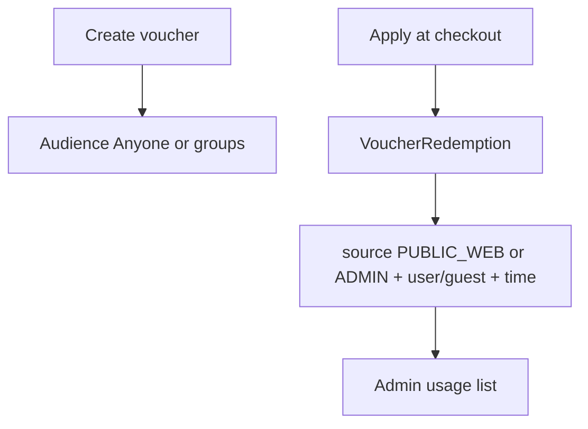

# Voucher audience groups + usage history

## Defaults chosen

- **Anyone** = public (no audience locks) — registered or walk-in with the code.
- **Guests / Staff / Shareholders** each have: **None | Selected (1+) | All**.
- Groups can **combine**. **Anyone** clears all group locks.
- **All Guests** = checkout with `guestId` or `guestEmail`.
- **All Staff** = any `User` identity; **All Shareholders** = any `Shareholder` identity.
- Selected rows stay on `VoucherAssignee`; “All” uses boolean flags on `Voucher`.
- **Usage list** on each voucher: who used it, when, how much discount, booking/order ref, **surface** (`PUBLIC_WEB` | `ADMIN`).



---

## 1. Audience schema

On `Voucher` in [`schema.prisma`](apps/server/prisma/schema.prisma):

```prisma
audienceAllGuests       Boolean @default(false)
audienceAllStaff        Boolean @default(false)
audienceAllShareholders Boolean @default(false)
```

`db push` + generate.

---

## 2. Audience validate + lookup

Same as before: create/update accept flags + `assignees[]`; checkout match selected **or** All-group; lookup/mine include All flags for matching identities.

---

## 3. Admin audience UI

[`Vouchers.tsx`](apps/admin/src/pages/Vouchers/Vouchers.tsx): Anyone vs Restricted with Guests/Staff/Shareholders = None | Selected | All (multi pickers for Selected).

---

## 4. Redemption usage metadata

Today [`VoucherRedemption`](apps/server/prisma/schema.prisma) has `redeemedById`, `guestId`, `referenceType/Id`, `amountDiscounted`, `createdAt` — but **no source** (web vs admin) and often no guest email.

### Schema additions on `VoucherRedemption`

```prisma
source      String?   // PUBLIC_WEB | ADMIN
channel     String?   // ROOM | DAY_LONG | RESTAURANT
guestEmail  String?
```

### Record at apply time

Extend [`recordVoucherRedemption`](apps/server/src/utils/voucher.ts) opts with `source`, `channel`, `guestEmail`.

Call sites:

| Caller | source |
|--------|--------|
| [`publicController.ts`](apps/server/src/controllers/publicController.ts) booking (and day-long public if any) | `PUBLIC_WEB` |
| [`bookingController.ts`](apps/server/src/controllers/bookingController.ts) | `ADMIN` |
| [`dayLongController.ts`](apps/server/src/controllers/dayLongController.ts) admin create | `ADMIN` |
| [`restaurantController.ts`](apps/server/src/controllers/restaurantController.ts) | `ADMIN` |

Pass `redeemedById` (staff user when admin), `guestId` / `guestEmail` when known, `channel` matching validate channel.

### API

Enrich existing `GET /vouchers/:id/redemptions` ([`listRedemptions`](apps/server/src/controllers/voucherController.ts)):

- Join/light-fetch: staff user name/email via `redeemedById`, guest name/email via `guestId` + stored `guestEmail`.
- Return: `createdAt`, `amountDiscounted`, `source`, `channel`, `referenceType`, `referenceId`, `redeemedBy` `{ id, name }`, `guest` `{ id, name, email }`.

---

## 5. Admin usage UI

On [`Vouchers.tsx`](apps/admin/src/pages/Vouchers/Vouchers.tsx) (row click or “Uses” button):

- Dialog/drawer: voucher summary + **Usage history** table.
- Columns: When, Source (Public web / Admin), Channel, Who (guest email/name or staff name), Discount ৳, Reference (booking/order id short link if routes exist).
- Empty state: “No redemptions yet.”

---

## Out of scope

- Role-filtered “all staff except X”.
- Expanding All into per-person assignee rows.
- IP/device fingerprinting.
- Editing or voiding redemptions.
