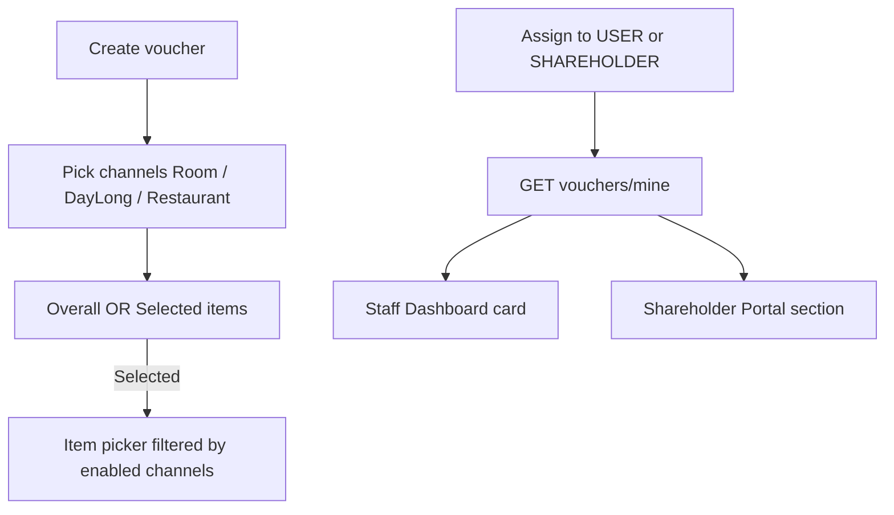

# Voucher channel scoping, migration, personal vouchers

## Defaults

- **DB:** run `prisma db push` from `apps/server` (repo convention; migrations gitignored). Add sample vouchers in [`seed.ts`](apps/server/prisma/seed.ts).
- **Staff vouchers:** card on Admin [`Dashboard.tsx`](apps/admin/src/pages/Dashboard/Dashboard.tsx) (“My vouchers”).
- **Shareholder vouchers:** section on [`ShareholderPortal.tsx`](apps/admin/src/pages/Portal/ShareholderPortal.tsx); light polish (clearer hierarchy, empty states).
- **Codes:** list shows name, discount, channels, expiry, uses left, `codeHint` only (plaintext still one-shot at create).

---

## 1. Schema push + seed

- From `apps/server`: `pnpm exec prisma generate` + `pnpm exec prisma db push` (ensures `Voucher` / discount columns exist on the running DB).
- Seed 2–3 demo vouchers: public overall %, Day Long selected-product sample, one `assigneeType: SHAREHOLDER` for demo shareholder, one `assigneeType: USER` for a seeded staff user. Store hashes via existing `hashVoucherCode`; log plaintext once in seed console for local testing.

---

## 2. Channel-scoped item picking (create UX + server)

### Admin [`Vouchers.tsx`](apps/admin/src/pages/Vouchers/Vouchers.tsx)

Rewrite the “Applies to” + “Selected items” block:

1. Channel checkboxes (at least one required).
2. Scope: **Overall** (all eligible totals on those channels) vs **Selected items**.
3. If Selected items: show **one picker per enabled channel** (not a free item-type dropdown):
   - Room → rooms list
   - Day Long → day-long products
   - Restaurant → menu items
4. Unchecking a channel clears that channel’s selected IDs and hides its picker.
5. Payload `items[]` may mix `ROOM` / `DAY_LONG_PRODUCT` / `MENU_ITEM` as long as each type’s channel flag is true.

### Server

- In [`voucherValidator.ts`](apps/server/src/validators/voucherValidator.ts) + create/update in [`voucherController.ts`](apps/server/src/controllers/voucherController.ts):
  - Reject if no channel enabled.
  - If `SELECTED_ITEMS`: every `itemType` must map to an enabled channel (`ROOM`→`appliesRoom`, etc.); reject orphans.
  - If `SELECTED_ITEMS`: require ≥1 item.
- Keep checkout logic in [`utils/voucher.ts`](apps/server/src/utils/voucher.ts); optional clearer error when channel OK but no line items match.

---

## 3. Personal vouchers API

Add **`GET /api/vouchers/mine`** in [`voucherRoutes.ts`](apps/server/src/routes/voucherRoutes.ts) / [`voucherController.ts`](apps/server/src/controllers/voucherController.ts):

- Auth: any authenticated user (not manage-only).
- Query:
  - Always: `assigneeType: USER` + `assigneeId: req.user.id`
  - If user has a `Shareholder` row (`userId`): also include `assigneeType: SHAREHOLDER` + that `shareholder.id`
- Filters: `isActive`, not expired (or include expired with flag), order by `expiresAt`.
- Response: safe fields only (`id`, `name`, `description`, `discountType/Value`, `scope`, channels, dates, `maxRedemptions`, redemption count, `codeHint`, `assigneeType`). **No** `codeHash` / plaintext.

Also add **`GET /api/shareholder/vouchers`** in shareholder portal routes that reuses the same list filtered to that shareholder (portal already SHAREHOLDER-gated) for a clean portal client call.

---

## 4. Staff Dashboard card

In [`Dashboard.tsx`](apps/admin/src/pages/Dashboard/Dashboard.tsx):

- After Quick Actions (or below stats), fetch `GET /vouchers/mine`.
- Card: “My vouchers” — name, discount badge, channels, expiry, `••••hint`, empty state “No vouchers assigned to you”.
- Visible for all staff roles with dashboard access (hide section if empty for housekeeping/restaurant if preferred clutter reduction: **show when count > 0**, else compact empty line only for SUPER_ADMIN/MANAGER/RECEPTIONIST/ACCOUNTANT).

---

## 5. Shareholder portal polish + vouchers

In [`ShareholderPortal.tsx`](apps/admin/src/pages/Portal/ShareholderPortal.tsx):

- Add “My vouchers” section (fetch `/shareholder/vouchers`) with same safe fields.
- Light UX polish: clearer page header/subtitle, section labels, empty states for distributions and vouchers, consistent badge colors for PAID/PENDING.

---

## 6. RBAC

- `/vouchers/mine` available to any authenticated staff + shareholder session.
- Manage `/vouchers` unchanged (`SUPER_ADMIN` | `MANAGER` | `ACCOUNTANT`).
- No new sidebar route required (dashboard + portal surfaces).

## Out of scope

- Re-showing full plaintext codes after create.
- Guest self-serve voucher wallet on public web.
- Contra-revenue ledger entries for discounts.
